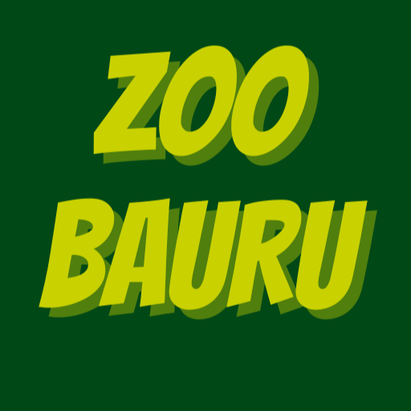
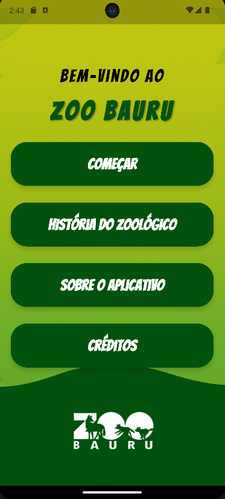
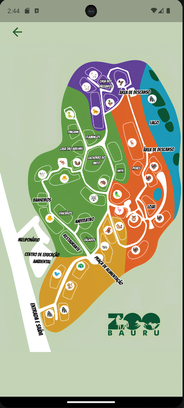
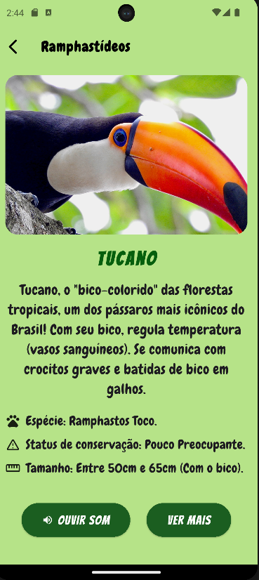
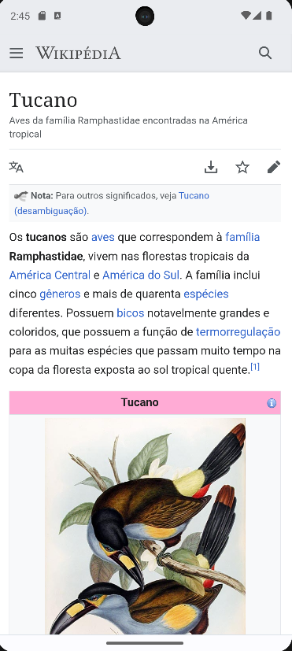

<div align="center">



# 🦁 Zoo Bauru — Guia Turístico

**Aplicativo mobile de guia interativo para o Zoológico Municipal de Bauru**

[](https://flutter.dev)
[](https://dart.dev)
[](https://www.android.com)
[](./README.md)

</div>

---

## 📱 Screenshots

<div align="center">

<table>
  <tr>
    <td align="center">
      <br/>
      <sub><b>🏠 Tela Inicial</b></sub>
    </td>
    <td align="center">
      <br/>
      <sub><b>🗺️ Mapa Interativo</b></sub>
    </td>
    <td align="center">
      <br/>
      <sub><b>🦜 Ficha do Animal</b></sub>
    </td>
    <td align="center">
      <br/>
      <sub><b>🔗 Saiba Mais (Wikipedia)</b></sub>
    </td>
  </tr>
</table>

<!-- 🎬 GIF de demonstração — grave com ScreenToGif ou o gravador de tela do Android e cole aqui -->
<!--  -->

</div>

---

## 🌿 Sobre o Projeto

O **Zoo Bauru** é um aplicativo desenvolvido em **Flutter** que aproxima o público do Zoológico Municipal de Bauru, oferecendo uma experiência informativa, intuitiva e interativa.

Os visitantes podem explorar o mapa do zoológico, conhecer os animais do plantel, ouvir os sons de cada espécie e acessar informações científicas — tudo na palma da mão.

> Desenvolvido como projeto de extensão da disciplina **Desenvolvimento de Software** no [Centro Universitário Sagrado Coração — UNISAGRADO](https://www.unisagrado.edu.br).

---

## ✨ Funcionalidades

- 🗺️ **Mapa interativo** do zoológico com zoom e navegação por toque
- 🐾 **Fichas completas** de mais de 25 animais com foto, curiosidades e dados científicos
- 🔊 **Sons reais** de cada espécie (audioplayers)
- 🔗 **Integração com Wikipedia** para aprofundamento
- 📖 **História do Zoológico** de Bauru desde 1977
- ℹ️ **Sobre o App** e tela de Créditos com equipe e apoiadores

---

## 🛠️ Tecnologias Utilizadas

| Tecnologia | Descrição |
|---|---|
| [Flutter](https://flutter.dev) | Framework principal (SDK 3.7+) |
| [Dart](https://dart.dev) | Linguagem de programação |
| [audioplayers ^5.2.1](https://pub.dev/packages/audioplayers) | Reprodução de sons dos animais |
| [url_launcher ^6.2.1](https://pub.dev/packages/url_launcher) | Abertura de links externos |
| Android Studio | IDE de desenvolvimento |

---

## 📋 Requisitos

- **Sistema Operacional:** Android 8.0 (Oreo) ou superior
- **Flutter SDK:** 3.27.0+
- **Dart SDK:** 3.7.2+

---

## 🚀 Como Executar

### 1. Clone o repositório

```bash
git clone https://github.com/cadu-ers/zoobaurumap.git
cd zoobaurumap
```

### 2. Instale as dependências

```bash
flutter pub get
```

### 3. Execute o app

```bash
flutter run
```

> ⚠️ Certifique-se de ter um emulador Android rodando ou um dispositivo físico conectado via USB com depuração ativada.

### 4. Gerar APK para instalação direta

```bash
flutter build apk --release
```

O arquivo gerado estará em `build/app/outputs/flutter-apk/app-release.apk`.

---

## 📂 Estrutura do Projeto

```
lib/
├── main.dart                    # Ponto de entrada
├── background_widget.dart       # Widget de fundo reutilizável
└── screens/
    ├── home_screen.dart         # Tela inicial
    ├── tela_comecar.dart        # Mapa interativo com botões dos animais
    ├── tela_historia.dart       # História do Zoológico
    ├── tela_sobre.dart          # Sobre o Aplicativo
    ├── tela_creditos.dart       # Créditos
    ├── text_box.dart            # Componente caixa de texto
    ├── custom_back_button.dart  # Botão de voltar customizado
    └── telas_animais/           # Telas individuais de cada animal (25+)
```

---

## 🐾 Animais Disponíveis

<details>
<summary>Ver lista completa (clique para expandir)</summary>

| Categoria | Animal |
|---|---|
| 🦜 Grandes Psitacídeos | Papagaio-Campeiro |
| 🦜 Pequenos Psitacídeos | Jandaia-Verdadeira |
| 🦅 Aves de Rapina | Urubu-Rei |
| 🦩 Aves Ribeirinhas | Guará |
| 🦆 Aves Marinhas | Cisne-Negro |
| 🐦 Aves Ratitas | Casuar |
| 🦉 Corujas | Suindara |
| 🦩 Grou-Coroado | Grou-Coroado |
| 🐥 Ramphastídeos | Tucano-Toco |
| 🐣 Pequenas Aves | Gralha |
| 🦚 Pavão | Pavão Arlequim |
| 🦍 Grandes Primatas BR | Guariba, Mico-Leão-Dourado, Mico-Leão-de-Cara-Dourada |
| 🐒 Pequenos Primatas BR | Macaco-Prego |
| 🦧 Primatas Africanos | Babuíno-Sagrado |
| 🐆 Grandes Felinos | Onça-Pintada |
| 🦘 Canguru | Canguru |
| 🦙 Camelídeos | Alpaca |
| 🦌 Cervídeos | Cervo-Dama |
| 🐺 Lobo-Guará | Lobo-Guará |
| 🦡 Tamanduá | Tamanduá-Mirim |
| 🦦 Irara | Irara |
| 🐿️ Pequenos Mamíferos | Furão |
| 🦔 Ouriço | Ouriço-Cacheiro |
| 🐍 Répteis | Jiboia |
| 🕊️ Aves Ribeirinhas | Guará-Vermelho |

</details>

---

## 👥 Equipe de Desenvolvimento

| Nome | Papel |
|---|---|
| Carlos Eduardo Rodrigues Silva | Desenvolvimento |
| Daniel Lucarelli Cerri | Desenvolvimento |
| Melck Silva de Oliveira Nascimento | Desenvolvimento |
| Murilo Moretto Marques | Desenvolvimento |
| Vinícius dos Santos | Desenvolvimento |

---

## 👨‍🏫 Orientação e Apoio

| | |
|---|---|
| **Professor Orientador** | Prof. Dr. Elvio Gilberto da Silva |
| **Colaboração** | Prof. Dr. João Marcelo Ribeiro Soares |
| **Parceiros** | Júlia Pitta e Aline Pereira — Zoo Bauru |
| **Instituição** | Centro Universitário Sagrado Coração — UNISAGRADO |
| **Curso** | Ciência da Computação |
| **Programa** | Fábrica de Software 2026 |

---

## 📄 Observação

Este aplicativo não contempla todos os animais presentes no zoológico, e alguns podem não estar representados em suas localizações exatas no mapa. As informações foram coletadas com apoio da equipe do Zoo Bauru.

---

<div align="center">

Feito com 💚 por alunos de Ciência da Computação da UNISAGRADO · Bauru, SP

</div>
